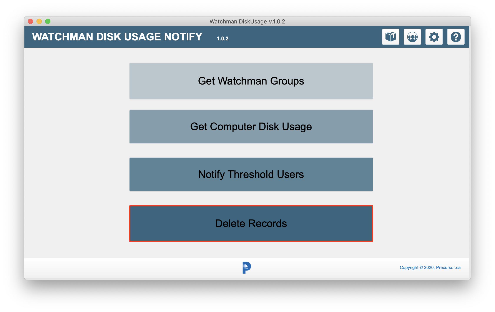

# Watchman Disk Usage

> v. 1.0.2 
> October 11, 2020  
> Alex Narvey / Precursor.ca  

A FileMaker tool to query a Watchman Montoring account via API calls and then send a notification email to users or managers indicating that comptuer boot drives are operating at over 90% (customicable) capapcity and suggesting what the user can do to mitigate the situation.

No warrantee is offered. Neither express nor implied. Use at your own risk.

To use this you require:

1) FileMaker software. You may obtain a demo from [Claris.com](https://claris.com) or get a license if you are a member of the Apple Consultants Network.

2) A https://watchmanmonitoring.com account that you have created an API key in for FileMaker to use.

3) You have turned on the Watchman reference email feature and supplied either computer references emails or a group reference email (or both).
See: [https://support.watchmanmonitoring.com/hc/en-us/articles/360012901731](https://support.watchmanmonitoring.com/hc/en-us/articles/360012901731)

## How it works

The Refresh and Email script step will delete all computers and groups so they can be refreshed. Then it will get all Watchman Groups and the computers there in. And finally it will send an email notification to any computer user whose boot disk is over 90% full.

The email will be sent to an individual comptuer user if the Watchman Computer Reference Email is specified and if that is blank the notificiation will be sent to the Group Reference Email.
If neither a computer not a group reference email has been sent no notification will be send for that particular computer.

## The email

The email is just a text-based email that says something like this:

*
This email is to notify you that the Precursor Health Agent has detected that your computer, named:
'John Doe's MacBook Air'
is running out of space.

The computer boot drive storage on 'John Doe's MacBook Air' is 98.59% full.

Typically, when storage is less than 10% free space you will begin to notice some slowdowns and when storage gets below 5% free space you risk crashes and data corruption/loss.

So the time to tidy is up is now. We have a web page that discusses the best ways to clear off space and you can check it out at: 

https://www.precursor.ca/Precursor/resources/storage-guide.html
*

## Customization

Most things, like the threshold value and notification text are easily customizable within FileMaker.

## Help

A very basic Help file is available at:

[https://www.precursor.ca/wdu](https://www.precursor.ca/wdu)

### 

## Updates

* October 11, 2020 Version 1.0.2

## Contributors
* Alex Narvey

—
Alex Narvey
precursor.ca
